# Manuális Tesztelés

---

A maximális felhasználói élmény érdekében elengedhetetlen a manuális tesztelés a
játékok területén. A játék valós idejű tesztelése fontos lépés a tervezett funkciók és viselkedés
ellenőrzésében, hogy biztosítsuk a specifikációk szerinti működést. A manuális tesztelés során
a tesztelők interaktívan játszanak a játékkal, kipróbálják a különböző játékterveket, funkciókat
és forgatókönyveket. Ez lehetővé teszi a valós problémák, hibák és hiányosságok
azonosítását, amelyek befolyásolhatják a felhasználói élményt. A manuális tesztelés által
nyújtott visszajelzés segít a fejlesztőknek a játék minőségének javításában és
finomhangolásában. Ezáltal a manuális tesztelés létfontosságú a játékok fejlesztésében, hogy
a játék valóban úgy működjön, ahogy tervezték, és a játékosoknak optimális élményt
nyújtson.

## Funkciók tesztelése:
Játék létrehozása, betöltése
-  Játékosok létrehozása
-  Mozgás
-  Action
- Gyűjtés
- Lopás
- Eldobás
___

## Tesztek:

### Leírás:
Játék létrehozása, betöltése és játékosok létrehozása
### Lépések:
1. program elindítása pl:
    - Az indításhoz szükséges:
    - Le kell tölteni a maven-t.
    - A projekt root mappájában egy cmd-t nyitni:
    - java -cp target/meow-1.0-SNAPSHOT.jar main.java.Main
2. Start new Game gomb lenyomása
3. Játékosok megadása
4. Start new Game gomb lenyomása
5. A Cancel gombot is ki kell próbálni
6. Figyelni a nem logikus és rendellenes viselkedést
### Elvárt eredmény (képek):
Játékosok megadásával a játék elindítható

 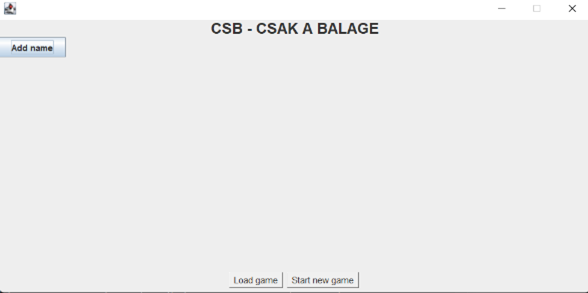
 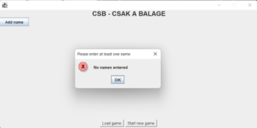
 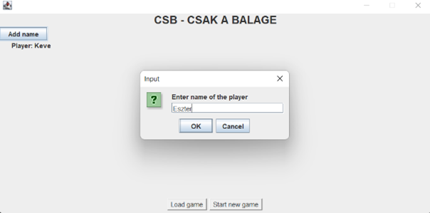
 

### Siker/Hiba:
- Logikai hiba: A játék nem egy
játékosra van tervezve így egy
játékossal lényegét veszti.
- Ezen kívül a teszt sikeresen elvégezhető
- A Cancel gomb is tökéletesen működik.
### Megjegyzések:

 - Legalább egy játékosnak kell lennie, hogy a játék elindulhasson
---

### Leírás:
Mozgás vizsgálata. A mozgás, mint egy akció vizsgálata.

### Lépések:
1. Az action tab-ról a Move menüpont kiválasztása
2. a felugró ablakról a célmező kiválasztása
3. Az új view megjelenésének ellenőrzése
4. Egy új játék generálásában ezeket kipróbálni megint
5. Figyelni a nem logikus és rendellenes viselkedést
### Elvárt eredmény (képek):
Elvárás, hogy a mozgást az aktuális soron következő játékos elvégezze, és a mezők
kiválasztásnál az összes szomszédos mező fel legyen sorolva megfelelő azonosítókkal,
amikkel lehet rájuk hivatkozni.

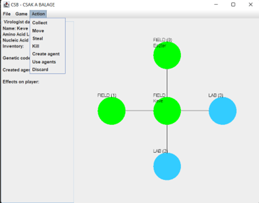
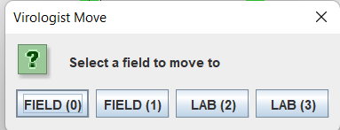
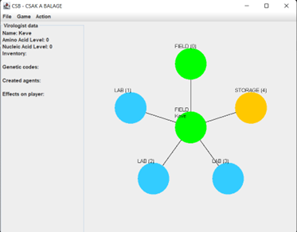

### Siker/Hiba:
A teszt sikeresen elvégezhető.

HIBA:
Ebben a helyzetben hiába választom ki a Lab(0)-t nem tesz rá a játék, helyette a Shelter-re
rak. (Nincs rajtam MedveVírus)

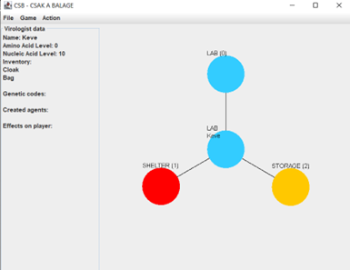
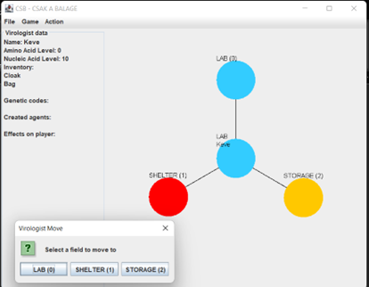
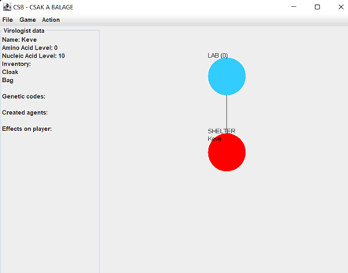

Lehetséges hiba:
Minden lépés után megváltoznak a mezők nevei, tehát a játékra nézve golbálisan nem lehet
egyértelműen azonosítani egy mezőt. Ami egyszer Lab(0) egy lépés után lehet Lab(1) is

### Megjegyzések:
Minden körben csak egyet lehet lépni.

---

### Leírás:
Az akciók számának ellenőrzése véletlenszerű módon. Csak 2 akciót lehet-e végezni.
(kevesebbet, többet) Mi számít akciónak.

### Lépések:
1. Két véletlenszerű akció elvégzése
2. További akcióra való lehetőség keresése
3. kör lezárása End Round gomb segítségével
4. Az előző lépéseket 4x, 5x megismételni, hogy mindenféle különböző eszközt, ágenst
   és Nucleic Acidot is begyűjtsünk.

### Elvárt eredmény (képek):

### Siker/Hiba:
A játék nem írja ki, hogy az aktuális soron lévő játékosnak hány akciója van még hátra.
Egyébként minden esetre szépen reagál a program és a dokumentáció szerint működik.
Az akcióknál a felugró akcióspecifikus kis ablakot bezártam, akkor az nem számolódik
akciónak.
### Megjegyzések:
Az aktuális soron lévő játékos körét 0, 1 vagy 2 akció után lehet bezárni.
Akciónak számít az is, ha például a Collect menüpontot választottuk, de az adott mezőn
nincsen semmi és nem tudtunk begyűjteni semmit. Mégis elhasználódik egy akció.
Figyelni kell, hogy ne legyen a játékos Medve vírusos, különben nem működik a teszt.

---

### Leírás:
A gyűjtés akció vizsgálata. Hány objektumot lehet begyűjteni.
### Lépések:
- Kipróbálni minél több fajta ágens és eszköz gyűjtését
- Az inventoriban ellenőrizni, hogy megjelenik-e a begyűjtött objektum
- Figyelni a nem logikus és rendellenes viselkedést

### Elvárt eredmény (képek):
Két akcióval maximum két objektumot lehet begyűjteni
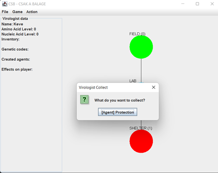
### Siker/Hiba:
Az inventory-kban szépen megjelennek az eszközök, ágensek.
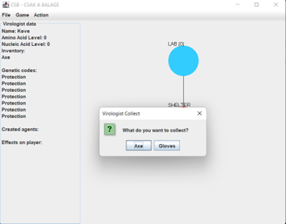
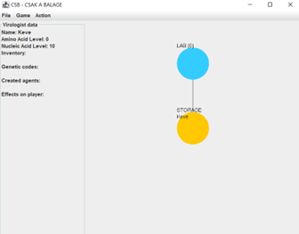

Nucleic Acid is szépen megjelenik a helyén.
HIBA: a játék engedi, hogy begyűjtsünk még Nucleic Acid-ot, de már nem veszi be a Level-hez.:

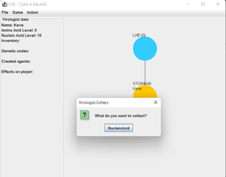

HIBA: A begyűjtés nem számít akciónak. Végtelen ágenst lehet gyűjteni.

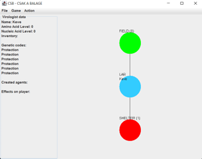
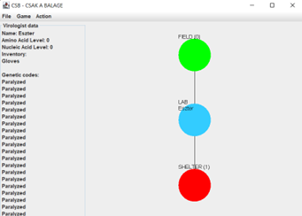

### Megjegyzések:
A „collect” nem számít akciónak. A genetikai kódokból végtelen mennyiségűt lehet gyűjteni,
az eszközök viszont szépen megjelennek az inventory-ban.
---

### Leírás:
Eldobás vizsgálata
### Lépések:
- begyűjtök az egyik játékossal legalább két objektumot
- Az Action menüből kiválasztom a legalsót: Discard
- Többször megismételni az előző lépést különböző objektumokkal.
- Figyelni a nem logikus és rendellenes viselkedést
### Elvárt eredmény (képek):

### Siker/Hiba:
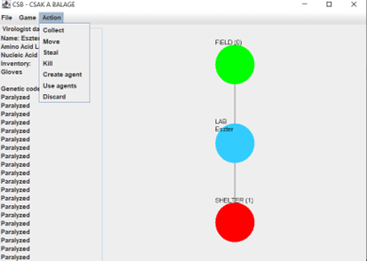
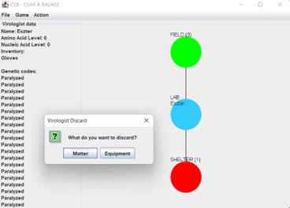
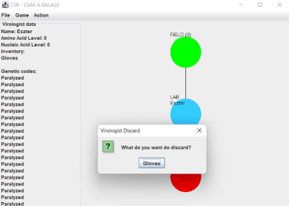

Az inventory-ból szépen el lehet dobni mindent. Ha valami olyat akarok eldobni, amim nincs, akkor  egy megfelelő felugró ablak
jelzi, hogy nincs nekem pl: Amino Acidom:

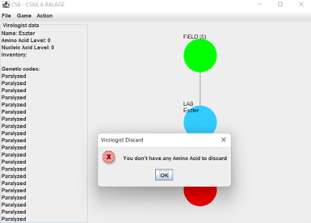

HIBA: Genetikai kódot/ágenst nem lehet eldobni.
### Megjegyzések:

- Figyelni kell, hogy ne legyen a játékos Medve vírusos, különben nem működik a teszt.
---

### Leírás:
Lopás vizsgálata
### Lépések:
- Az egyik karakterrel gyűjtsünk össze legalább 2 tárgyat az inventory-ba
- Mozgassuk a karaktereket egy közös mezőre
- Az Akciók közül válasszuk a Steal opciót
- Válasszuk ki kitől akarunk lopni
- válasszuk ki mit akarunk lopni
- Ismételjük meg az előző lépéseket
- az útközbeni visszavonás (ablak bezárása) opciót is próbáljuk ki
- Figyeljük a rendellenességeket
### Elvárt eredmény:
A lopott objektum jelenjen meg a tolvaj inventory-ában.
### Siker/Hiba:
Ha olyat választunk ki, ami nincs a karakternek, akkor egy ennek megfelelő felugró ablakkal
a játék ezt a tényt(, hogy nem tudunk lopni) tudtunkra adja.

Kevének van egy Zsákja és egy Kesztyűje

Eszter lop Kevétől
Egy másik példában nincs medve vírus alatt egyik szereplő sem.
HIBA: Ilyenkor, vírus hatás nélkül nem jelenik meg a A tolvaj inventory-ában a lopott eszköz.
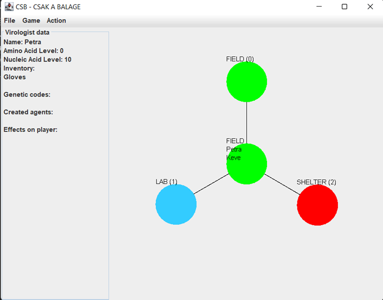
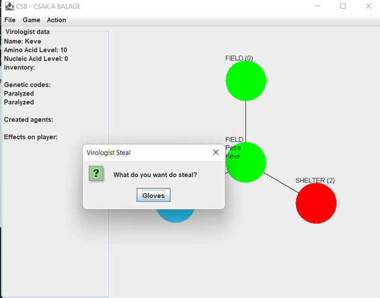
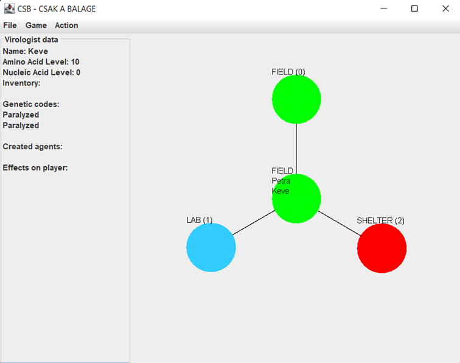

### Megjegyzések:
- Medvetánc alatt a lopás nem működik.
---