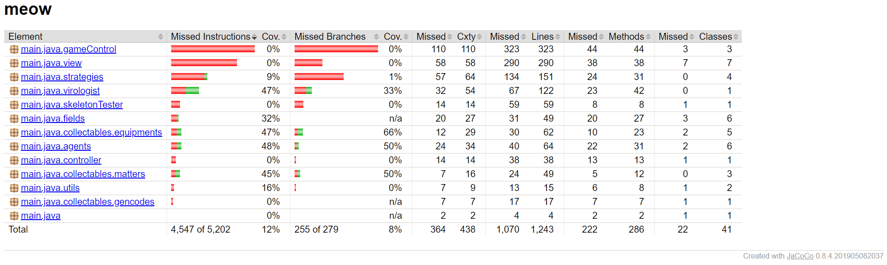
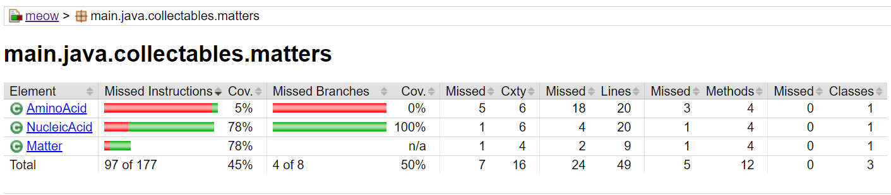
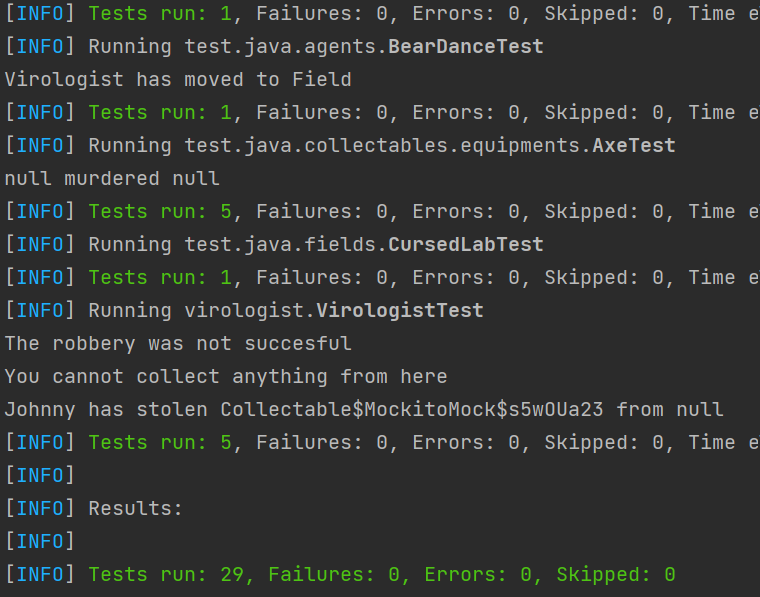

# Unit tesztek készítése és a kódlefedettség vizsgálata

A feladat unit tesztek készítése volt, majd a kódlefedettség vizsgálata és ezek alapján a tesztkészlet bővítése. A tesztek készítéséhez a jUnit keretrendszert, az osztályok közötti függőségek mock-olására Mockito-t használtam.

A Code Coverage JaCoCo-val vizsgálva:

A tesztek kódlefedettségének javítására hozzááadtam a VirologistTest és NucleicAcidTest osztályokat:

A Unit tesztek futtatása során felfedeztem egy hibát az Axe osztály murder metódusában:

A bug javítása után minden test sikeresen fut:

